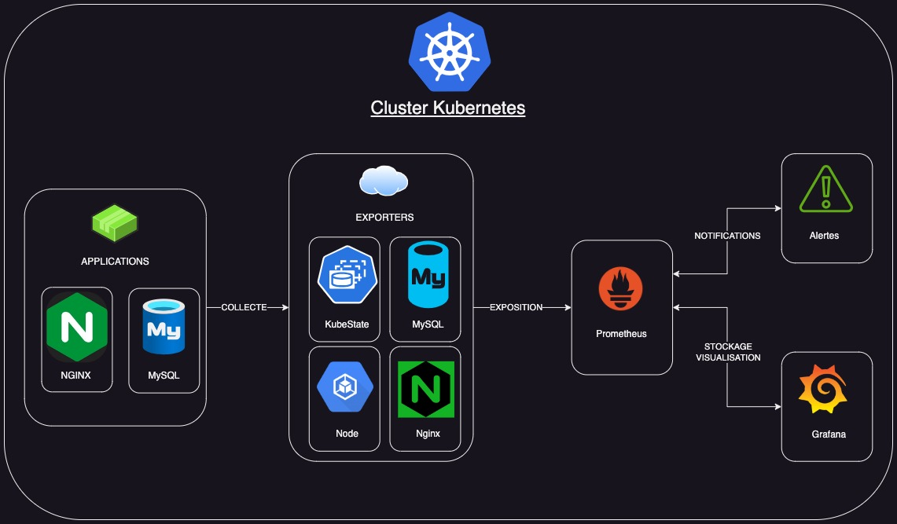
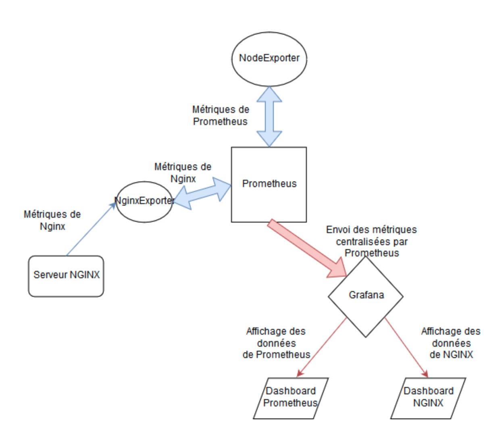

# TP6-monitoring

Documentation de la Solution de Supervision Kubernetes

## 1- Présentation:

Cette documentation décrit la mise en place d'une solution de supervision centralisée pour surveiller un cluster Kubernetes et les applications qu'il contient. La solution utilise Prometheus pour la collecte de métriques, Grafana pour la visualisation des tableaux de bord et les Exporters nécessaires pour récupérer les métriques des différentes composantes du cluster et des applications.

## 2- Arborescence des Fichiers

``` shell
. # Arborescence du repository
├── README.md
├── alerts
│   ├── alert.rules
│   └── kube-node-cpu-alerts.yaml
├── deploy-gke-cluster
│   ├── README.md
│   ├── ansible
│   │   ├── ansible.cfg
│   │   ├── inventory.ini
│   │   ├── playbook.yml
│   │   ├── roles
│   │   │   └── gke-cluster
│   │   │       ├── handlers
│   │   │       │   └── main.yml
│   │   │       └── tasks
│   │   │           └── main.yml
│   │   └── vars.yml
│   ├── creation-inventory.sh
│   ├── credentials.json
│   ├── deploy.sh
│   ├── terraform
│   │   ├── firewall
│   │   │   ├── main.tf
│   │   │   ├── outputs.tf
│   │   │   └── variables.tf
│   │   ├── gke-cluster
│   │   │   ├── main.tf
│   │   │   ├── outputs.tf
│   │   │   └── variables.tf
│   │   ├── main.tf
│   │   ├── outputs.tf
│   │   ├── service_account
│   │   │   ├── main.tf
│   │   │   ├── outputs.tf
│   │   │   └── variables.tf
│   │   ├── terraform.tfstate
│   │   ├── terraform.tfstate.backup
│   │   ├── variables.tf
│   │   └── vpc
│   │       ├── main.tf
│   │       ├── outputs.tf
│   │       └── variables.tf
│   └── terraform-destroy.sh
├── exporter
│   ├── kube-state-metrics-deployment.yaml
│   ├── kube-state-metrics-service.yaml
│   ├── mysql-exporter-deployment.yaml
│   ├── mysql-exporter-service.yaml
│   ├── nginx-exporter-deployment.yaml
│   ├── nginx-exporter-service.yaml
│   ├── node-exporter-deployment.yaml
│   └── node-exporter-service.yaml
├── grafana
│   ├── grafana-deployment.yaml
│   └── grafana-service.yaml
├── mysql
│   ├── mysql-deployment.yaml
│   └── mysql-service.yaml
├── nginx
│   ├── nginx-deployment.yaml
│   └── nginx-service.yaml
├── prometheus
│   ├── prometheus-deployment.yaml
│   └── prometheus-service.yaml
├── schema
│   ├── supervision-app-exporters.jpg
│   ├── supervision-app.drawio
│   ├── supervision-app.drawio.pdf
│   └── supervision-app.jpg
└── tp_6_monitoring.pdf

19 directories, 52 files

```

## 3- Prérequis :

Avant de déployer la solution de supervision, assurez-vous que :

- Le cluster Kubernetes est déjà déployé et prêt à recevoir de nouveaux déploiements.
- Vous disposez d'un accès administrateur pour créer des Déploiements, Services et ConfigMaps dans le cluster.

## 4- Architecture :

Architecture globale:


Focus sur fonctionnement des exporters:


## 5- Déploiement :

Pour déployer la solution de supervision, suivez les étapes ci-dessous :

### a- Déployez Prometheus, Grafana et les Exporters :

  - kubectl apply -f prometheus/prometheus.yaml
  - kubectl apply -f grafana/grafana.yaml
  - kubectl apply -f exporters/

### b- Déployez les applications de démonstration (Nginx et MySQL) :

  - kubectl apply -f applications/

## 6- Configuration :

La configuration de la solution de supervision se trouve dans les fichiers YAML suivants :

  - prometheus/prometheus.yaml : Déploiement de Prometheus.
  - prometheus/prometheus-config.yaml : Configuration Prometheus (prometheus.yml).
  - grafana/grafana.yaml : Déploiement de Grafana.
  - grafana/dashboards/ : Fichiers JSON des tableaux de bord Grafana.
  - exporters/ : Déploiements des Exporters Prometheus pour récupérer les métriques.
  - applications/ : Déploiements des applications de démonstration (Nginx et MySQL).
  - alerts/ : Fichiers YAML des alertes Prometheus.

## 7- Métriques Importantes :

Les métriques collectées sont liées aux quatre Signaux d'Or :

- Latence
- Utilisation CPU
- Utilisation Mémoire
- Saturation des Ressources

Les métriques collectées incluent celles provenant de Node Exporter, Kube State Metrics Exporter, Nginx Exporter, MySQL Exporter, etc.

## 8- Utilisation des Tableaux de Bord :

Pour utiliser les tableaux de bord fournis avec Grafana :

- Déployez les fichiers JSON des tableaux de bord via l'interface Grafana.
- Explorez les tableaux de bord pour surveiller les différentes composantes du cluster et des applications.

## 9- Alertes :

Les alertes Prometheus sont définies dans les fichiers YAML du dossier alerts/. Les alertes importantes ont été configurées pour les métriques critiques, comme la haute utilisation CPU sur les nœuds Kubernetes.

## 10- Ajouter de nouvelles Métriques :

Pour ajouter des métriques d'une nouvelle application à superviser :

- Déployez l'Exporter Prometheus approprié pour la nouvelle application.
- Définissez les requêtes PromQL pour récupérer les métriques importantes de cette application.
- Créez des tableaux de bord Grafana pour visualiser ces métriques.

## Conclusion :
La solution de supervision est maintenant déployée et configurée avec Prometheus pour la collecte de métriques, Grafana pour la visualisation des tableaux de bord et les Exporters pour récupérer les métriques des différentes composantes du cluster Kubernetes et des applications. Utilisez les tableaux de bord et les alertes pour surveiller la santé de votre infrastructure Kubernetes et des applications déployées.
